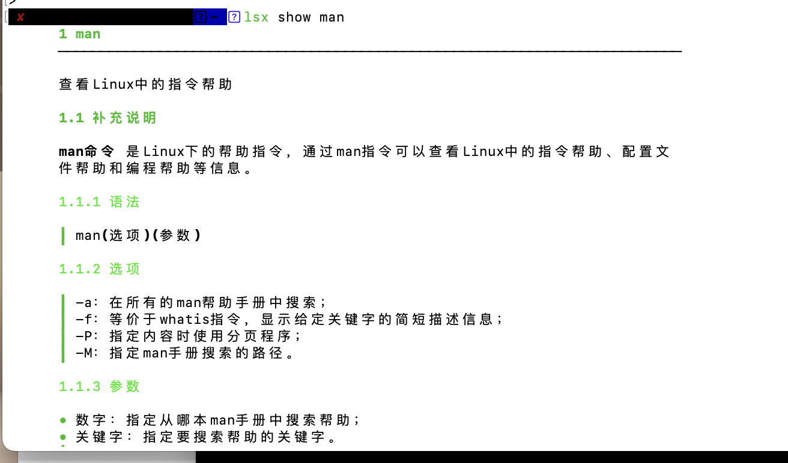
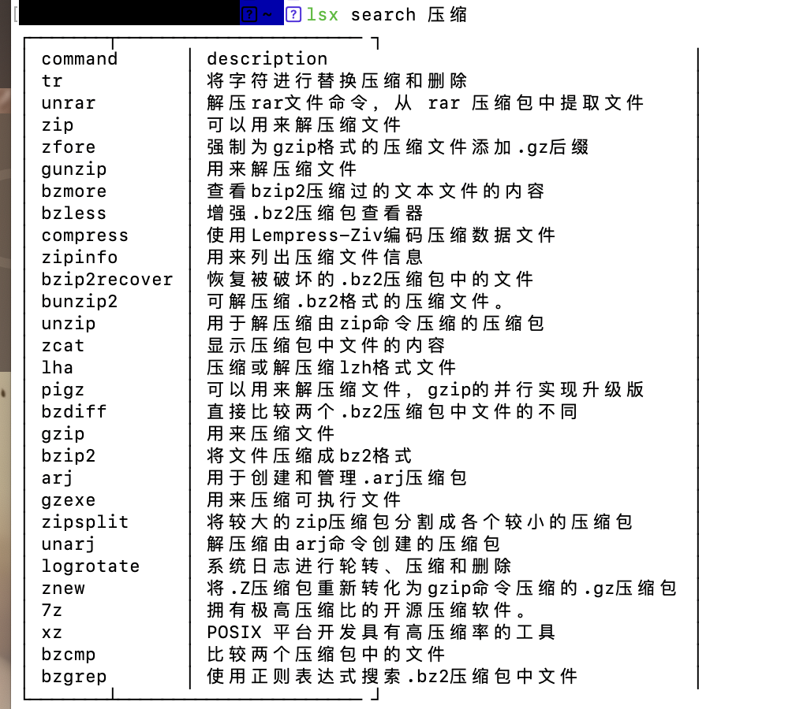

# lsx

> 该项目是基于 [pls](https://github.com/chenjiandongx/pls) 项目进行二次开发的版本，在此感谢原作者 chenjiandongx 的贡献。
由于该项目已经多年没有更新，linux-command项目已经更新了许多命令，每次都需要拉取最新命令列表，再打包比较麻烦。故在大佬的基础上，开发lsx项目，优化一些逻辑和数据结构，以适配最新的linux-command项目。

## 特性

- 支持通过关键字搜索 Linux 命令
- 提供详细的命令使用说明
- 支持更新内置的 Linux 命令数据库
- 支持多平台适配（包括 ARM 和 AMD 架构）
- 支持输出结果管道传输（如 `| less`）
- 自动化构建和发布流程

## 安装

### 1) 使用编译好的二进制版本

https://github.com/CJSen/lsx/releases

## 使用方法
1) 下载并解压到任意目录下，赋予可执行文件权限，重命名为 `lsx`

2) 复制`lsx`到`/usr/local/bin`等可直接查找使用的环境目录下，方便全局使用

3) 相关命令使用方法

```shell
~ 🐶 lsx --help
Impressive Linux commands cheat sheet cli.

Usage:
  lsx [command]

Available Commands:
  help        Help about any command
  search      Search command by keywords
  show        Show the specified command usage.
  upcommands  Update the embedded linux-command.json to the latest version.
  upgrade     Upgrade all commands from remote.
  version     Prints the version of lsx

Flags:
  -h, --help   help for lsx

Use "lsx [command] --help" for more information about a command.
```

建议第一次使用的时候先初始化所有命令(需联网)
```shell
lsx upcommands && lsx upgrade
```

数据文件默认位于 `~/.lsx/xxx` 可以更改环境变量LSXCONFIG的值来调整配置文件，设置数据存放路径

支持将输出结果传入到 less 管道
```shell
$ 🐶 lsx show curl | less
```

效果图




## 构建流程

项目使用自动化构建脚本 `build.sh`，支持以下特性：

- 多平台构建（Linux、macOS、Windows）
- 多架构支持（amd64 和 arm64）
- 自动下载最新的 linux-command 数据
- 自动化版本号管理

构建命令：
```shell
./build.sh
```

构建产物会生成在当前目录下，包含以下文件：
- lsx_{os}_{arch}[.exe]
- 其中 {os} 是操作系统，{arch} 是架构

## 开发贡献

该项目欢迎贡献和改进。主要改进方向包括：

- 扩展更多 Linux 命令
- 改进用户界面和交互体验
- 优化性能和稳定性
- 支持更多平台和架构

对于重大改动，建议先创建 issue 讨论。对于小的改进可以直接提交 PR。

## 致谢

特别感谢jaywcjlove开发的[linux-command](https://github.com/jaywcjlove/linux-command) 为本项目的开发提供了基础。
特别感谢原作者 chenjiandongx 开发了 [pls](https://github.com/chenjiandongx/pls) 项目。

## LICENSE

MIT [@CJSen](https://github.com/CJSen)